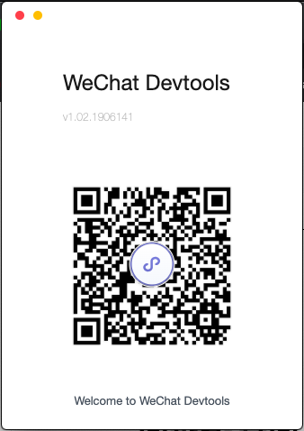

# triprws


During my summer internship at [@USER Experience Researchers](https://www.user.com.sg/) I developed a WeChat Mini Program written using JavaScript, WXML and CSS as part of the [First Global WeChat Developer Challenge in Singapore](https://www.wechatdeveloperchallenge.com/past_Events.html). The application was submitted to Resorts World Sentosa (RWS) proposed challenge of aiming to leverage Mini Programs to communicate RWS as an integrated resort to travelers, and engage travelers from the time of travel booking all the way to post-arrival by offering points of interest information, reviews, tips, on site purchase of services, and more. Our submission was awarded winner of the public vote award and received $2000. 

This application aims to increase post arrival expenses of Chinese tourists in Resort World Sentosa. Tourists can interactively navigate the resort, book hotels and tickets in advance, scan QR codes instead of physical tickets and much much more... allowing for a truly immersive and seamless experience for tourists. 

check out some of the mobile designs below

<p align="center">
  
  
  
  
</p>

# Execution instructions

To view or edit the mini program, follow the instructions below.

1. Download the WeChat Devloper IDE [here](https://developers.weixin.qq.com/miniprogram/en/dev/devtools/download.html)

2. Sign up for a WeiXin/WeChat account [here](https://mp.weixin.qq.com/cgi-bin/loginpage?t=wxm2-login&lang=zh_CN)

3. Clone this repository
```
$ git clone 
```
4. Start the Development Tool and use your Wechat account to scan the homescreen QR code in order to log in


5. Open the project and start editing

